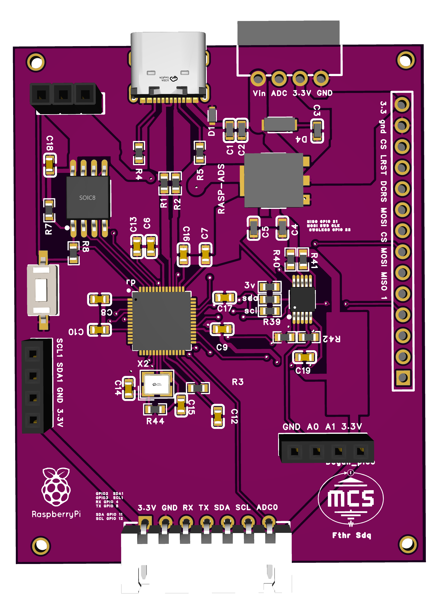

# RP2040-ADC16bit-CustomBoard
This repository documents the development of a custom board based on the RP2040 microcontroller, integrated with a high-resolution 16-bit external ADC. Designed for precision measurement applications in biophysics and geophysics, the board features validated PCB layout, minimal firmware, and complete technical documentation.

# RP2040-ADC16bit-CustomBoard

## 🧭 Project Overview
This repository showcases the development of a custom PCB based on the RP2040 microcontroller, integrated with a 16-bit external ADC (ADS1115). The board is designed for high-precision data acquisition in biophysics and geophysics applications, featuring validated layout, minimal firmware, and complete documentation.

---

## 🛠️ Technical Specifications

| Component         | Description                                                             |
|------------------|-------------------------------------------------------------------------|
| MCU              | Raspberry Pi RP2040 (Dual-core ARM Cortex-M0+)                          |
| External ADC     | ADS1115 (16-bit resolution, I²C interface, 4 channels)                  |
| Operating Voltage| 3.3V (regulated via onboard LDO)                                        |
| Interface        | USB-C for communication and programming                                 |
| PCB              | 2-layer, 50mm x 30mm, validated via DRC and ERC                         |
| Firmware         | Written in C using the official Pico SDK                                |
| Sampling Rate    | Up to 860 SPS (configurable via ADS1115 settings)                      |

---

---

## 📷 Visual Documentation

- High-resolution photos of the board (front and back)
- PCB layout screenshots EasyEda(JLCPCB)
- Wiring diagram: RP2040 ↔ ADS1115

## 🖼️ Board Preview

